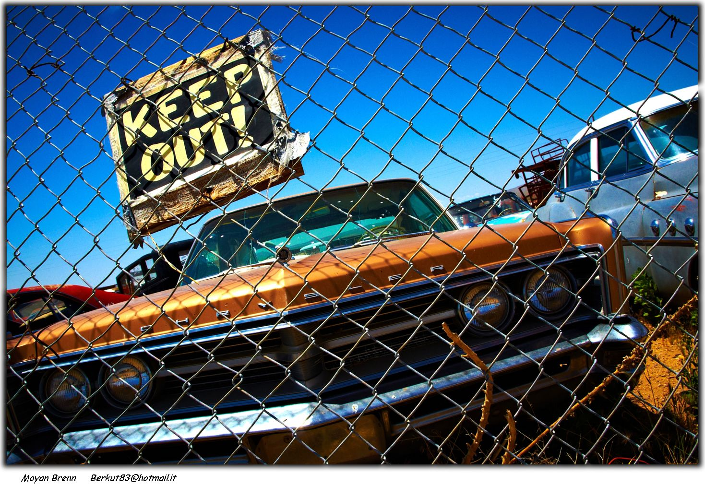
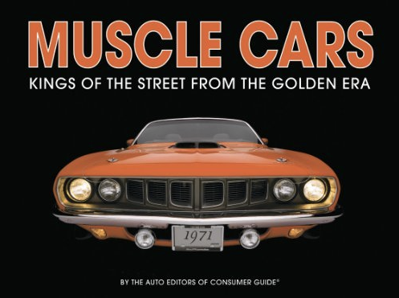
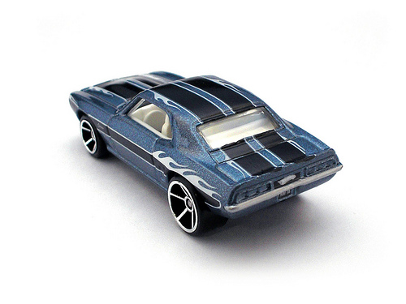
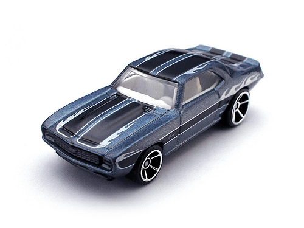

Muscle Cars of the 70's
==========================

Introduction
-------------
The 70's were a great decade for car manufacturers and speedfreaks alike. Lots of great models were constructed and later modified by hobbiest, race teams and enthusiasts all over the globe. This page tries to give a little insight of this great Era.

Want to know more?
--------------
The one great book on this topic that has to be named here, is this one:

you can get it from [amazon][1] or [barnes & noble][2].

[1]: http://www.amazon.com/gp/product/images/1412715229/ref=dp_image_z_0?ie=utf8&n=283155&s=books
[2]: http://www.barnesandnoble.com/w/muscle-cars-auto-editors-of-consumer-guide/1018815262

Miniatures
----------
Some models where that famous that they even made miniature toy cars of it:

Images courtesy of [Leap Kye](http://www.flickr.com/photos/leapkye/), licensed under CC-BY-ND 2.0

Top-level image courtesy of [Moyann Brenn](http://www.flickr.com/photos/aigle_dore/ "Image source") licensed under CC-BY-ND 2.0
